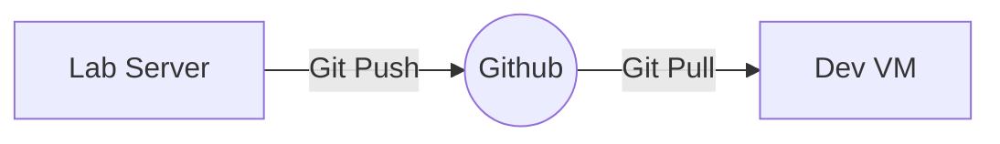

# Chatter QA Automation Framework

This directory contains the Quality Assurance tooling developed for the Chatter application.

## Why I built this

This framework was developed as a practical exercise in modern QA engineering. Rather than simply writing automated tests, the goal was to build a maintainable, production-style automation framework using Playwright, GitHub, Page Object Models, reusable fixtures, API validation, CI/CD, and supporting QA utilities. The project mirrors the workflow and practices commonly used by professional software development teams.

#### Roadmap

- [x] Initialize Playwright
- [ ] Login automation
- [ ] Registration tests
- [ ] Messaging regression suite
- [ ] Image upload tests
- [ ] Mobile layout validation
- [ ] API verification
- [ ] Database validation
- [ ] GitHub Actions pipeline
- [ ] Security regression suite

## Current Components

### Playwright
- End-to-end UI automation
- Smoke tests
- Regression suites
- Page Object Model
- Fixtures
- Authentication helpers

### Python
- Test data generation
- Database verification
- Utility scripts

### Postman
- API collections
- Environment files
- Authentication testing

### Security
- Burp Suite notes
- Security regression tests
- OWASP testing

### Performance
- Performance and load testing (planned)

## Technology Stack

- Playwright
- TypeScript
- Python
- Postman
- GitHub Actions
- Git
